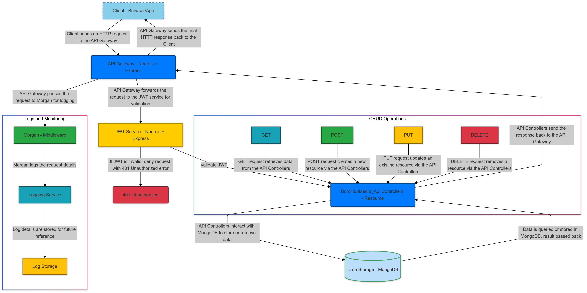

# BoroHubMedia Social Media REST API

A backend REST API for a social media platform with basic CRUD operations for members, posts, comments and chats.

## Introduction

BoroHubMedia is a backend REST API for a social media platform. It is built using Node.js, Express, and MongoDB and has endpoints for authenticating members, member management, posts, comments and chats. The API provides member authentication, member management, post and comment functionalities, likes/dislikes, and robust error checking and response utilities.

## Architecture Diagram



### Diagram Explanation

- **Client**: Represents the members accessing the API through various clients like mobile apps or web applications.
- **API Server**: Built with Node.js and Express, handling requests and responses.
- **Database**: MongoDB serves as the data storage layer, managing member data, posts, comments, and chats.
- **Authentication**: Demonstrates how member authentication is managed through JWT tokens.

## Features

- **Authentication Management**: Account initialization, access Account(login), endSession(logout), and session retrieval.
- **Member Management**: Profile updates, following/unfollowing, and member restrictions(block/unblock), member access token refresh.
- **Content Post Management**: Create, update, retrieve, like/unlike, and delete posts.
- **Comment Management**: Create, update, retrieve, like/unlike, reply to comments, like/dislike comment replies, and delete comments.
- **Chat Management**: Create chat, chatEntry(send messages), retrieve and delete chat capabilities for members.

## Architectural Overview

The BoroHubMedia API is structured in a modular way, allowing for clear separation of concerns and maintainability. Here’s a high-level overview of the architecture:

1. **Server**: The API is built on an Express server, which handles incoming requests and routes them to the appropriate controllers.

2. **Controllers**: Each controller (e.g., `MemberController`, `ContentController`) contains static methods that define the logic for handling requests related to specific resources. They interact with the models to perform CRUD operations and return responses.

3. **Models**: The API uses Mongoose models (e.g., `Member`, `Content`, `Comment`) to define the structure of the data stored in MongoDB. These models represent the database schema and provide methods for interacting with the database.

4. **Middleware**: Middleware functions (e.g., for authentication, error handling, CORS) are used to process requests before they reach the controllers. This allows for reusable logic that can be applied to multiple routes.

5. **Routes**: The API defines routes for different functionalities (e.g., authentication, member management, content management) that map to the appropriate controller methods.

6. **Error Handling**: A centralized error handling mechanism ensures that errors are caught and formatted consistently, providing meaningful feedback to clients.

7. **Database**: MongoDB is used as the database to store member information, posts, comments, and chat data. The API connects to the database using Mongoose.

This architecture promotes scalability and maintainability, making it easier to add new features and manage existing ones.

## HTTP Status Codes and Error Handling

The API employs comprehensive error handling to ensure a smooth member experience. Below are the common HTTP status codes you may encounter, along with their meanings:

### Success Codes

- **200 OK**: The request was successful, and the server returned the requested data.
- **201 Created**: The request was successful, and a new resource was created (e.g., a new content post).
- **204 No Content**: The request was successful, but there is no content to return (e.g., after a successful delete operation).

### Client Error Codes

- **400 Bad Request**: The request could not be processed due to invalid input or missing parameters.
- **401 Unauthorized**: The request requires member authentication or the provided credentials are invalid.
- **403 Forbidden**: The server understood the request but refuses to authorize it.
- **404 Not Found**: The requested resource was not found or does not exist on the server.
- **409 Conflict**: The request could not be completed due to a conflict with the current state of the resource.
- **429 Too Many Requests**: The member has sent too many requests in a given amount of time(e.g Rate limiting for when a member attempts more than five times within 5mins to login with wrong handle or password).

### Server Error Codes

- **500 Internal Server Error**: The server encountered an unexpected condition that prevented it from fulfilling the request.
- **503 Service Unavailable**: The server is currently unable to handle the request due to temporary overloading or maintenance.

### Error Responses

Error responses will include a JSON object with a message detailing the error. For example:

```json
{
  "error": "Too many requests. Please try again later",
  "status": 429
}
```

Additionally, the API utilizes a custom error handling function called BDERROR to standardize error responses. It also provides utility functions, sendSuccessResponse and sendErrorResponse, to ensure that all responses are formatted uniformly. This enhances the overall user experience by providing clear and consistent feedback to the client.

# Step-by-Step Guide to Set Up and Test the API

## 1. Clone Repository

Clone the repository using the following command in your terminal:

```bash
git clone https://github.com/borisngong/Alx-Webstack-Portfolio_BoroHuBMedia.git
cd Alx-Webstack-Portfolio_BoroHuBMedia
cd BoroHubMedia_Backend
```

## BoroHubMedia_Backend

This directory contains the backend code for BoroHubMedia API

## 2. Install Dependencies

Make sure you have Node.js installed by checking the version:

```bash
node -v
```

If Node.js is not installed, install it using:

```bash
nvm install node
```

Then, install the required dependencies:

```bash
npm install
```

Additionally, install dotenv for environment variable management:

```bash
npm install dotenv
```

## 3. Run the API

Ensure you're in the BoroHubMedia_Backend directory

```bash
pwd
```

Get the current working directory, if true proceed to next step

## Start the server

```bash
npm start
```

Alternatively, for development mode with automatic restarts:

```bash
npm run dev
```

Nodeman automatically restarts the server when changes made to the code are saved

## Verify the Server is Running

To ensure that the server is running correctly:

1. **Open your web browser** and navigate to the following URL:

```
http://localhost:3000/api-docs
```

This will display the Swagger documentation for the API.
This will display the Swagger documentation for the API.

2. **Check your terminal** for the following messages:

- Environmental variables loaded
- Server running on `http://localhost:3000` (or your desired port)
- Swagger documentation (view-only) is available
- Database connected successfully

These messages confirm that the server is operational and ready to handle requests.
You can now use tools like Postman or cURL to test the API endpoints.

## 4. Set Up Postman

### Download and Install Postman:

- If you don't already have Postman, download it from [here](https://www.postman.com/downloads/).
- Install and launch Postman.

### Import the Postman Collection:

- Open the provided Postman collection link: **BoroHubMedia API Documentation**.
- Click the "Run in Postman" button to import the collection into your Postman workspace.

### Set Up Environment Variables:

- In Postman, create a new environment (e.g., I used **borohubmedia**).
- Ensure the environment is written like this: `{{borohubmedia}}` before adding endpoints(e.g `{{borohubmedia}}`auth/initializeAccount)
- Add the following variables:
  - `base_url`: `http://localhost:3000/api/` (or your server's base URL).
  - `access_token`: Leave blank; it will be populated automatically after authentication.
  - `refresh_token`: Leave blank; it will be populated automatically after authentication.

## 5. Test Authentication Endpoints

### Initialize an Account:

1. In Postman, go to the **Authentication Management** folder.
2. Select the **initializeAccount Endpoint** request
3. Set the request body to **raw JSON** and provide this payload:
   ```json
   {
     "fullName": "Your Full Name",
     "handle": "yourHandle",
     "emailAddress": "youremail@example.com",
     "plainPassword": "yourPassword123",
     "aboutMe": "A brief description about yourself",
     "role": "member"
   }
   ```
   Role can either be member or admin
4. Click **Send** to create an account

### Access Account (Login):

1. Select **AccessAccount Endpoint**
2. Set the request body to **raw JSON** and provide:
   ```json
   {
     "email": "existingMember@example.com",
     "password": "securePassword123"
   }
   ```
3. Click **Send** to log in. The response will include `access_token` and `refresh_token`, which Postman will store.

### Get Current Session:

1. Select **GetMemberSession Endpont**
2. Click **Send** to retrieve user details

### End Session (Logout):

1. Select **EndMemberSession Endpoint**.
2. Click **Send** to log out

## 6. Test Member Management Endpoints

### Update Member Dtails:

1. Select **Update Member Endpoint**.
2. Set the request body to **raw JSON**:
   ```json
   {
     "fullName": "Updated Name",
     "bio": "Updated bio information"
   }
   ```
3. Click **Send** to update the member details

### Upload Profile Picture:

1. Select **Upload member's Profile Picture**
2. Use **POST** with **form-data**
3. Add a key `avatar` and upload an image
4. Click **Send**

### Follow a Member:

1. Select **Follow a Member**
2. Replace `:memberId` in the URL
3. Click **Send**

## 7. Test Content Post Management Endpoints

### Create Content Post:

1. Select **Create Content Post With Images**
2. Use **POST** with **form-data**
3. Add `content`: "This is my first post"
4. Upload at least 4 images
5. Click **Send**

### Like a Post:

1. Select **Like a Content Post**
2. Replace `:postId` in the URL
3. Click **Send**

### Delete a Post:

1. Select **Delete Content Post**
2. Replace `:postId` in the URL
3. Click **Send**

## 8. Test Comment Management Endpoints

### Create a Comment:

1. Select **Create Comment Endpont**
2. Set the request body to **raw JSON**:
   ```json
   {
     "content": "This is a comment on the post"
   }
   ```
3. Click **Send**

### Like a Comment:

1. Select **Like Comment Endpoint**
2. Replace `:commentId` in the URL
3. Click **Send**

### Delete a Comment:

1. Select **Delete Comment**
2. Replace `:commentId` in the URL
3. Click **Send**

## 9. Test Chat Management Endpoints

### Create a Chat:

- Select the **Chat Creation Endpoint** request
- Set the request body to `raw` and `JSON`
- Provide the following sample payload:
  ```json
  {
    "participants": ["memberId1", "memberId2"]
  }
  ```
- Click **Send** to create the chat
  You can add as much participants as you want using the foemat above

### Send a Message:

- Select the **Chat Entry Creation Endpoint** request.
- Replace `:chatId` in the URL with the ID of the chat
- Set the request body to `raw` and `JSON`
- Provide the following sample payload:
  ```json
  {
    "message": "Hello, this is a test message for BoroHubMedia"
  }
  ```
- Click **Send** to send the message.

### Delete a Chat:

- Select the **Chat Deletion Endpoint** request.
- Replace `:chatId` in the URL with the ID of the chat you want to delete.
- Click **Send** to delete the chat

---

## 10. Test Other Endpoints

You can test additional endpoints following the same procedures. Select the appropriate request from the Postman collection, modify parameters, and click **Send**.

## 11. Test Error Handling

### Invalid Login Attempts:

- Use incorrect credentials for **Access Account**.
- Observe `429 Too Many Requests` after multiple failures.

### Unauthorized Access:

- Try accessing protected endpoints without logging in.
- Observe `401 Unauthorized` error

### Resource Not Found:

- Access a non-existent resource (e.g., invalid `postId`)
- Observe `404 Not Found` error

## 12. Additional Tips

### Use Postman Environments:

- Switch between environments (e.g., development, production) for testing.

### Save Responses:

- Store request/response pairs for reference.

### Debugging:

- Use **View > Show Postman Console** to debug requests and responses.

## Prerequisites for Testing BoroHubMedia API by Creating Your Database and .env File

Follow the link to download and install MongoDB

- [MongoDB](https://www.mongodb.com/): Database management system used to store data for the API.

## Installation Instructions

### Step 1: Set Up MongoDB Connection

You can either use **MongoDB Atlas (cloud)** or install **MongoDB locally**.

#### Option 1: MongoDB Atlas (Cloud)

1. Go to [MongoDB Atlas](https://www.mongodb.com/cloud/atlas) and create an account
2. Log in and set up a new cluster (choose the free option for testing purposes)
3. Create a new database in your cluster

#### Option 2: MongoDB Local

1. Follow the [installation instructions here](https://docs.mongodb.com/manual/installation/).
2. Start the MongoDB service by running the `mongod` command in your terminal.

---

### Step 2: Create a `.env` File

In the BoroHubMedia_Backend directory, create a `.env` file to store your environment variables:

Create the .env file:

```bash
touch .env
```

### Step 3: Configure Environment Variables

To configure your environment variables, create a `.env` file in the `BoroHubMedia_Backend` directory and add the following variables:

### Step 3: Configure Environment Variables

To configure your environment variables, create a `.env` file in the `BoroHubMedia_Backend` directory and add the following variables:

```plaintext
PORT=3000
DB_URI="mongodb+srv://<username>:<password>@<cluster>.mongodb.net/?retryWrites=true&w=majority&appName=<appName>"
SKEY_JWT="<your_secret_key_here>"
EXP_JWT="<expiration_time>"
UPLOADS_BASE_URL="http://localhost:3000" # Change to your server URL
REFRESH_JWT="<your_refresh_token_here>"
SKEY_JWT_REFRESH="<your_refresh_secret_key_here>"
EXP_JWT_REFRESH="<refresh_expiration_time>"
```

## N.B

- Ensure that you replace the placeholder with actual values values (like `<expiration_time>`, `your_secret_key_here`, `<your_refresh_token_here>`, `<username>`, `<password>`, etc.) with your actual credentials and preferred settings.
- This `.env` file is crucial for your application to run correctly, as it contains sensitive information and configurations.

### Explanation of Environment Variables:

- **`PORT`**: Port number for the server (default: 3000).
- **`SKEY_JWT`**: Secret key for signing JWT tokens.
- **`EXP_JWT`**: Expiration time for JWT tokens (e.g., `24h` for 24 hours).
- **`UPLOADS_BASE_URL`**: Base URL for media uploads.
- **`DB_URI`**: MongoDB connection string. Replace `<username>`, `<password>`, `<cluster>`, and `<database>` with your actual MongoDB Atlas credentials that you created above.
- **`SKEY_JWT_REFRESH`**: Secret key for signing refresh tokens.
- **`EXP_JWT_REFRESH`**: Expiration time for refresh tokens.
- **`REFRESH_JWT`**: Refresh token for authentication.

---

You can now proceed to run the api with your .env and Database following step 3 above **RUN API**

## Basic Usage

Once the API is running, you can use a REST API client (like Postman or Insomnia) to interact with the API endpoints. These endpoints allow you to manage authentication, members, content posts, feedback comments, and chat functionalities. You can test the API endpoints using the Postman collection provided in the documentation section below.

### Default Base URL

The default base URL for the server is:

```plaintext
http://localhost:3000
```

If you are running the API on a different port, remember to replace localhost:3000 with the appropriate base URL.

## API Documentation

For detailed information on request parameters, response formats, and example payloads, check out the following resources:

- **Swagger Static Documentation**: Access the this Url for VIEW ONLY when the sever is running: [Link for VIEW ONLY since swagger do not accept automatic authentication using cookies, but allows manual authentication using them, This API is design to use cookies for authencation](http://localhost:3000/api-docs)
- **Postman Collection**: Access the this Url for view:. [Link to BoroHubMedia API Documentation](https://documenter.getpostman.com/view/40210928/2sAYQggTiW)
- **Test Postman Collection**: Access this Url for API test: [Link to BoroHubMedia API Testing](https://www.postman.com/joint-operations-specialist-41505418/workspace/my-workspace/request/40210928-2b7fd524-3d0d-4693-9710-815f0c9471e4?action=share&creator=40210928&ctx=documentation&active-environment=40210928-c969341f-fbc9-401b-bb4c-d32e6f52f988)
  This resource will help you manage authentication, members, content posts, feedback comments, and chat functionalities.

### Using a REST API Client

Using a REST API client (like Postman or Insomnia) to interact with the endpoints. I chosed this tools because they are particularly useful for API testing during development for the following reasons:

- **Automatic Authorization**: Unlike tools like Swagger, which require manual entry of authorization headers or tokens, Postman and Insomnia automatically handle cookies populated by the API. This simplifies the testing process for APIs like mine that are designed to populate cookies automatically.

- **Streamlined Testing Workflow**: Postman and Insomnia offer advanced features for testing, such as saving request/response pairs, managing collections, and great debugging tools, which makes them a better choice in development and testing.

Since my API automatically populates cookies, using Postman or Insomnia ensures that you can efficiently test protected endpoints without the need for repetitive manual configurations(e.g setting the headers, tokens etc).

## API Endpoint Structure

The API's routes are organized under specific paths based on their functionalities.

---

### Authentication Routes

- **Base Route**: `/api/auth`
- **Example**:
  - **POST** `/api/auth/initializeAccount`
    Initializes a new account.

---

### Content Post Routes

- **Base Route**: `/api/content`
- **Example**:
  - **DELETE** `/api/content/delete-content/:postId`
    Deletes a content post by its ID.

---

### Member Management Routes

- **Base Route**: `/api/member`
- **Example**:
  - **PUT** `/api/member/follow/:memberId`
    Follows a specific member by their ID.

---

### Comment Management Routes

- **Base Route**: `/api/comment`
- **Example**:
  - **PUT** `/api/comment/update-comment/:commentId`
    Updates a specific comment by its ID.

---

### Chat Management Routes

- **Base Route**: `/api/chat`
- **Example**:
  - **GET** `/api/chat/get-chat/:chatID`
    Retrieves a specific chat by its ID.

---

## Summary

To access any of the above functionalities, append the relevant endpoint to the base URL if you havn't ser environment in either Postman, Insomnia etc. For example, to create a new content post, you would use:

```plaintext
POST http://localhost:3000/api/content/create-content-images/:memberID
```

Remeber to replace **Port Number** with actual port you're using

## API Endpoints

# Authentication Management API

This API provides endpoints for member authentication, including account initialization, login, session management, and logout. Below is a brief overview of the available endpoints, along with instructions on how to run each one.

### Endpoints Overview

1. **Initialize Account**:

   - **POST** `/api/auth/initializeAccount`
   - **How to Run**: To create a new member account, send a POST request to this endpoint with the following JSON body in the request:
   - **Example Request**:

   ```json
   {
     "fullName": "Your Full Name",
     "handle": "yourHandle",
     "emailAddress": "youremail@example.com",
     "plainPassword": "yourPassword123",
     "aboutMe": "A brief description about yourself",
     "role": "admin"
   }
   ```

   - **Role**: Member roles can either be admin or member, so fill in appropriately in the role field
   - **Note**: Joi is used for input validation, and the password is hashed using bcrypt.

2. **Access Account**:

   - **POST** `/api/auth/accessAccount`
   - **How to Run**: To log in, send a POST request to this endpoint with the member's email and password in the request body. Rate limiting is applied to prevent abuse.
   - **Example Request**:

   ```json
   {
     "email": "existingMember@example.com",
     "password": "securePassword123"
   }
   ```

3. **End Session**:

   - **GET** `/api/auth/endSession`
   - **How to Run**: To log out, send a GET request to this endpoint. Authenticated members can log out of their account to end the current session and invalidate or clear the access token and refresh tokens.

4. **Get Current Session**:
   - **GET** `/api/auth/getSession`
   - **How to Run**: To retrieve information about the current session, send a GET request to this endpoint. Authenticated members can access their session details, including all member information.

# Member Management API

This API provides endpoints for managing member accounts, including functionalities for creating, updating, following, unfollowing, and deleting members. Below is a brief overview of the available endpoints, along with instructions on how to run each one.

### Endpoints Overview

1. **Refresh Token**:

   - **POST** `/api/member/refresh-token`
   - **How to Run**: Authenticated members can refresh their access tokens by sending a POST request to this endpoint. This helps to extend the member session without the need to log in again.

2. **Delete a Member**:

   - **DELETE** `/api/member/delete/:memberId`
   - **How to Run**: Admin members can delete a member's account by sending a DELETE request to this endpoint with the member's unique identifier (`memberId`). This will remove all associated data and content.

3. **Retrieve Member Details**:

   - **GET** `/api/member/:memberId`
   - **How to Run**: Authenticated members can retrieve details of a specific member by sending a GET request to this endpoint with the member's unique identifier.

4. **Update Member Details**:

   - **PUT** `/api/member/update/:memberId`
   - **How to Run**: Authenticated members can update their details by sending a PUT request to this endpoint with the updated information in the request body.
   - **Example Request**:

   ```json
   {
     "fullName": "Updated Name",
     "bio": "Updated bio information"
   }
   ```

5. **Follow a Member**:

   - **PUT** `/api/member/follow/:memberId`
   - **How to Run**: Authenticated members can follow another member by sending a PUT request to this endpoint with the member's unique identifier (`memberId`). This adds the member ID to the followers array of the member being followed.

6. **Unfollow a Member**:

   - **DELETE** `/api/member/unfollow/:memberId`
   - **How to Run**: Members can remove their like from a specific comment by sending a DELETE request to this endpoint with the comment's ID. Only the author of the comment or an admin can delete it if it doesn't adhere to rules.

7. **Get Followers List**:

   - **GET** `/api/member/followers/:memberId`
   - **How to Run**: Authenticated members can retrieve a list of followers for a specific member by sending a GET request to this endpoint with the member's unique identifier.

8. **Restrict a Member**:

   - **POST** `/api/member/restricted/`
   - **How to Run**: Authenticated members can restrict/block another member's account by sending a POST request to this endpoint with the member's unique identifier in the request body. This blocks them from interacting with the member's content.

9. **Unrestrict a Member**:

   - **DELETE** `/api/member/unrestricted/`
   - **How to Run**: Authenticated members can unrestrict/unblock another member's account by sending a DELETE request to this endpoint with the member's unique identifier in the request body. This allows them to interact with the member's content again.

10. **Get Restricted List**:

    - **GET** `/api/member/restricted-list/:memberId`
    - **How to Run**: Members can retrieve a list of restricted members by sending a GET request to this endpoint with their unique identifier.

11. **Search for a Member by Handle**:

    - **GET** `/api/member/search/:handle`
    - **How to Run**: Members can search for other members by their handles or usernames by sending a GET request to this endpoint with the handle as a parameter.

12. **Upload Profile Picture**:

    - **POST** `/api/member/avatarUpload/`
    - **How to Run**: Authenticated members can upload their profile pictures by sending a POST request to this endpoint. Use Postman or Insomnia to set the request type to `POST` and select `form-data` in the body.
    - **Fields**:
      - `avatar`: (File) Upload the profile picture file.
    - **Example Request**:
      - In Insomnia, set the key as `avatar` and select the image file to upload.
      - In Postman, first upload your image file to Postman cloud storage. To do this, click on the "File" option in the `avatar` field, then select "Upload Files" from your local storage. After uploading, you can select the file from Postman cloud storage. The response will include the member's detailed profile with the URL for the uploaded profile image.

13. **Upload Cover Picture**:
    - **PUT** `/api/member/coverImageUpload/`
    - **How to Run**: Authenticated members can upload their cover pictures by sending a PUT request to this endpoint. Use Postman or Insomnia to set the request type to `PUT` and select `form-data` in the body.
    - **Fields**:
      - `coverImage`: (File) Upload the cover picture file.
    - **Example Request**:
      - In Insomnia, set the key as `coverImage` and select the image file to upload.
      - In Postman, first upload your cover image file to Postman cloud storage. To do this, click on the "File" option in the `coverImage` field, then select "Upload Files" from your local storage. After uploading, you can select the file from Postman cloud storage. The response will include the member's detailed profile with the URL for the uploaded cover picture.

# Content Post Management API

This API provides endpoints for managing content posts, including creating, updating, retrieving, liking, unliking, and deleting posts. Below is a brief overview of the available endpoints, along with instructions on how to run each one using Postman.

### Endpoints Overview

1. **Create Content Images**:

   - **POST** `/api/content/create-content-images/:memberId`
   - **How to Run**: Authenticated members can create a new content post with or without images by sending a POST request to this endpoint. Use Postman or Insomnia to set the request type to `POST` and select `form-data` in the body.
   - **Fields**:
     - `content`: (String) The text content of the post.
     - `media`: (File) Upload at least 4 media files.
   - **Example Request**:
     - In Insomnia, set the key as `content` and the value as your post text. For `media`, add multiple keys with the same name (`media`) and select files to upload.
     - In Postman, first upload your files to Postman cloud storage. To do this, click on the "File" option in the `media` field, then select "Upload Files" from your local storage. After uploading, you can select the files from Postman cloud storage. Set the key as `content` and the value as your post text. You can easily add multiple files by clicking the "Add" button next to the `media` key.

2. **Update Content**:

   - **PUT** `/api/content/update-content/:postId`
   - **How to Run**: Members can update their existing content post by sending a PUT request to this endpoint. Use Postman to set the request type to `PUT` and select `form-data` in the body.
   - **Fields**:
     - `content`: (String) The updated text content of the post.
     - `media`: (File) Upload updated media files (optional).
   - **Example Request**:
     - In Postman, set the key as `content` and the value as the updated post text.
     - For `media`, add multiple keys with the same name (`media`) and select files to upload.

3. **Get Member Content**:

   - **GET** `/api/content/get-member-content/:memberId`
   - **How to Run**: To retrieve all content posts created by a specific member, send a GET request to this endpoint with the member's unique identifier (`memberId`).

4. **Get Specific Content Post**:

   - **GET** `/api/content/get-content/:postId`
   - **How to Run**: To fetch details of a specific content post, send a GET request to this endpoint with the post's ID. This will return details of the author and handle of who created the post.

5. **Like Content Post**:

   - **PUT** `/api/content/like-content/:postId`
   - **How to Run**: Authenticated members can like a specific content post by sending a PUT request to this endpoint with the post's ID. This adds their member ID to the post's likes array.

6. **Unlike Content Post**:

   - **PUT** `/api/content/unlike-content/:postId`
   - **How to Run**: Members can remove their like from a specific content post by sending a PUT request to this endpoint with the post's ID. This removes their member ID from the likes array.

7. **Delete Content Post**:
   - **DELETE** `/api/content/delete-content/:postId`
   - **How to Run**: Members can delete a specific content post by sending a DELETE request to this endpoint with the post's ID. Note that only the author of the post or an admin can delete it in case of a violation of rules.

# Feedback Comment Management API

This API provides endpoints for managing feedback comments, including creating, updating, liking, unliking, and deleting comments and replies. Below is a brief overview of the available endpoints:

### Endpoints Overview

1. **Create Comment**:

   - **POST** `/api/comment/create-comment/`
   - **How to Run**: Authenticated members can create a new comment on a specific content post by sending a POST request to this endpoint.
   - **Fields**:
     - `content`: (String) The text content of the comment.
   - **Example Request**:
     ```json
     {
       "content": "This is my comment on the post."
     }
     ```

2. **Update Comment**:

   - **PUT** `/api/comment/update-comment/:commentId`
   - **How to Run**: Authenticated members can update an existing comment by sending a PUT request to this endpoint with the comment's ID. Members can only update comments they have created.
   - **Fields**:
     - `content`: (String) The updated text content of the comment.
   - **Example Request**:
     ```json
     {
       "content": "This is my updated comment."
     }
     ```

3. **Create Comment Reply**:

   - **POST** `/api/comment/comment-reply`
   - **How to Run**: Authenticated members can reply to a specific comment on a content post by sending a POST request to this endpoint.
   - **Fields**:
     - `commentId`: (String) The ID of the comment being replied to.
     - `content`: (String) The text content of the reply.
   - **Example Request**:
     ```json
     {
       "commentId": "12345",
       "content": "This is my reply to the comment."
     }
     ```

4. **Like Comment Reply**:

   - **PUT** `/api/comment/like-comment-reply/:replyId`
   - **How to Run**: Authenticated members can like a specific comment reply by sending a PUT request to this endpoint with the reply's ID.

5. **Dislike Comment Reply**:

   - **PUT** `/api/comment/dislike-comment-reply/:replyId`
   - **How to Run**: Authenticated members can dislike a specific comment reply by sending a PUT request to this endpoint with the reply's ID.

6. **Like Comment**:

   - **PUT** `/api/comment/like-comment/:commentId`
   - **How to Run**: Authenticated members can like a specific comment by sending a PUT request to this endpoint with the comment's ID.

7. **Unlike Comment**:

   - **PUT** `/api/comment/unlike-comment/:commentId`
   - **How to Run**: Authenticated members can remove their like from a specific comment by sending a PUT request to this endpoint with the comment's ID.

8. **Delete Comment**:
   - **DELETE** `/api/comment/delete-comment/:commentId`
   - **How to Run**: Authenticated members can delete a specific comment by sending a DELETE request to this endpoint with the comment's ID. Only the author of the comment or an admin can delete it if it doesn't adhere to rules.

# Chat Management API

This API provides endpoints for managing chat functionalities, including creating chats, adding entries, retrieving chats, and deleting them. Below is a brief overview of the available endpoints:

### Endpoints Overview

1. **Create a Chat**:

   - **POST** `/api/chat/create-chat`
   - **How to Run**: Authenticated members can create a new chat with at least one participant. The chat creator is automatically added as a participant.
   - **Fields**:
     - `participants`: (Array of Strings) An array of member IDs to be added as participants in the chat.
   - **Example Request**:
     ```json
     {
       "participants": ["memberId1", "memberId2"]
     }
     ```

2. **Create a Chat Entry**:

   - **POST** `/api/chat/create-chat-entry/:chatId`
   - **How to Run**: Users can add a new message to an existing chat by sending a POST request to this endpoint with the chat's ID. Members must be participants in the chat to add a message.
   - **Fields**:
     - `message`: (String) The content of the message being sent.
   - **Example Request**:
     ```json
     {
       "message": "Hello, everyone!"
     }
     ```

3. **Get a Chat**:

   - **GET** `/api/chat/get-chat/:chatId`
   - **How to Run**: To retrieve the details and messages of a specific chat, send a GET request to this endpoint with the chat's ID.

4. **Delete a Chat**:
   - **DELETE** `/api/chat/delete-chat/:chatId`
   - **How to Run**: Members can delete a specific chat by sending a DELETE request to this endpoint with the chat's ID. Only the creator of the chat or an admin can delete it if it doesn't adhere to rules.

### Additional Information

For detailed information on request parameters, response formats, and example payloads, please refer to the Postman collection, which contains comprehensive documentation for each endpoint.

Please explore the Postman collection for more insights into managing authentication, members, content posts, feedback comments, and chat functionalities.
The Postman collection link can be found below in the documentation section.

## Project Structure

The following is the directory structure of the project, highlighting key components:

```plaintext
├── AUTHOR                                 # Author information
├── BoroHubMedia_Backend                   # Main backend directory
│   ├── .env                               # Environment variables file
│   ├── .eslintrc.js                       # ESLint configuration file
│   ├── .gitignore                         # Git ignore rules
│   ├── config.js                          # General configuration settings
│   ├── package.json                       # Project dependencies metadata
│   ├── package-lock.json                  # Dependency versions lock
│   ├── serverCore.js                      # Server initialization logic
│   ├── _bdmainEntry.js                    # Main entry point file
│   ├── docs                               # API documentation files
│   │   └── swagger.json                   # Swagger API documentation
│   ├── media                              # Media files directory
│   │   └── images                         # Subdirectory for images
│   │       ├── avatars                    # Avatar image files
│   │       ├── coverImages                # Cover image files
│   │       └── mediaFiles                 # Other media files
│   ├── _bd_api                            # API route definitions
│   │   ├── authSessionRoutes.js           # Authentication routes file
│   │   ├── chatRoutes.js                  # Chat routes file
│   │   ├── feedbackCommentRoutes.js       # Feedback comment routes
│   │   └── membersRoutes.js               # Member routes file
│   ├── configurations                     # Configuration files directory
│   │   ├── databaseSetup.js               # Database setup logic
│   │   └── environmentLoader.js           # Load environment variables
│   ├── controllers                        # Request handling logic
│   │   ├── authSessionControllers.js      # Authentication logic controller
│   │   ├── chatController.js              # Chat logic controller
│   │   ├── feedbackCommentController.js   # Feedback comment logic
│   │   └── memberControllers.js           # Member management logic
│   ├── coreModels                         # Core data models directory
│   │   ├── chat.js                        # Chat data model
│   │   ├── chatEntry.js                   # Chat entry model
│   │   ├── feedbackComment.js             # Feedback comment model
│   │   ├── memberSchema.js                # Member schema definition
│   │   └── schemas                        # Additional schema files
│   │       └── initializeAccountSchema.js # Account initialization schema with Joi for validations
│   ├── coreUtils                          # Utility functions directory
│   │   ├── _bd_responseHandlers.js        # Response handling utilities
│   │   ├── create-fileUrl.js              # File URL creation utility
│   │   ├── sanitized.js                   # Data sanitization utilities
│   │   └── tokenUtils.js                  # Token management utilities genrates access and refreh tokens
│   ├── middlewares                        # Middleware functions directory
│   │   ├── authIsAdmin.js                 # Admin authentication middleware
│   │   ├── handleErrors.js                # Error handling middleware
│   │   ├── mediaUploads.js                # Media upload middleware
│   │   ├── rateLimiter.js                 # Rate limiting middleware preventing server overload
│   │   └── setupMiddleware.js             # Middleware setup logic
│   └── swagger                            # Swagger setup files directory
│       └── setupSwagger.js                # Swagger initialization logic
|
└── README.md
                                       # Project documentation file

```

This is a high-level overview of the project structure.

## Definitions

- **Content**: A post created by a member, which may include text and optional media files.
- **Member**: A registered user on the platform.
- **Middleware**: Functions that handle requests and responses, including error handling and processing.
- **Endpoints**: API routes that facilitate interaction with the application.
- **API**: A set of rules and protocols for building and interacting with software applications.
- **Request**: A message sent by a client to a server to initiate an action or retrieve data.
- **Response**: A message sent by a server back to a client, containing the result of the requested action.
- **Authentication**: The process of verifying the identity of a member before granting access to certain features or data.
- **Authorization**: The process of determining whether a member has permission to perform a specific action or access certain resources.
- **Database**: A structured collection of data that is stored and managed for retrieval and manipulation.
- **Schema**: A blueprint or structure that defines how data is organized in a database, including tables and relationships.

### Common Issues

1. **Port Already in Use**:

   - Ensure no other process is running on the specified port.
   - Kill any processes using the port with:
     ```bash
     kill $(lsof -t -i:3000)
     ```

2. **MongoDB Connection Issues**:

   - Verify MongoDB URI and credentials in the `.env` file.
     -It is also good to add the willd card IP 0.0.0.0 to the access IP so that you can acces from all environments

3. **Missing Dependencies**:

   - If you encounter a "Module Not Found" error for `dotenv`, ensure that you have installed it by running:
     ```bash
     npm install dotenv
     ```

4. **Node.js Version**:

   - Ensure you are using Node.js version 16.x or later. You can check your Node.js version with:
     ```bash
     node -v
     ```

5. **Environment Variable Errors**:
   - Double-check your `.env` file for missing or incorrect variables.

### Features to Add

- Implement WebSocket-based real-time notifications.
- Develop advanced member and post search features.
- Introduce caching (e.g., Redis) to improve performance.
- Intend to add more detailed comprehensive documentation using Swagger, populating it whose local host link is already running in the api when started
  .

### Optimization Plans

- Optimize queries to increase response speeds.
- Incorporate analytics dashboards for user insights.

### User Experience

- Create a user-friendly frontend to showcase the API's capabilities.

## About the Author

Hi, I'm Ngong Boris Kukwah, an ALX Africa Fullstack Software Engineering student specializing in Backend Development. I’m passionate about building efficient, scalable, and robust applications. This project reflects my dedication to learning and implementing best practices in software development.

### Connect with Me

- **Name**: Ngong Boris Kukwah
- **Email**: [borisngong@gmail.com](mailto:borisngong@gmail.com)
- **LinkedIn**: [Ngong Boris Kukwah](https://www.linkedin.com/in/ngong-boris-kukwah-34063821a/)
- **Twitter**: [@boro_didier1](https://x.com/boro_didier1)
- **GitHub**: [borisngong](https://github.com/borisngong)
- **APIDOCUMENTATION**: [BoroHubMedia API Documentation](https://documenter.getpostman.com/view/40210928/2sAYQggTiW)
- **TestDocumentationInPostman**: [BoroHubMedia API Test](https://www.postman.com/joint-operations-specialist-41505418/workspace/my-workspace/request/40210928-2b7fd524-3d0d-4693-9710-815f0c9471e4?action=share&creator=40210928&ctx=documentation&active-environment=40210928-c969341f-fbc9-401b-bb4c-d32e6f52f988)
  <environment_details>

# VSCode Visible Files

Alx-Webstack-Portfolio_BoroHuBMedia/BoroHubMedia_Backend/package-lock.json

# VSCode Open Tabs

Alx-Webstack-Portfolio_BoroHuBMedia/BoroHubMedia_Backend/.env
Alx-Webstack-Portfolio_BoroHuBMedia/BoroHubMedia_Backend/.gitignore
Alx-Webstack-Portfolio_BoroHuBMedia/BoroHubMedia_Backend/controllers/memberControllers.js
Alx-Webstack-Portfolio_BoroHuBMedia/BoroHubMedia_Backend/serverCore.js
Alx-Webstack-Portfolio_BoroHuBMedia/BoroHubMedia_Backend/middlewares/setupMiddleware.js
Alx-Webstack-Portfolio_BoroHuBMedia/BoroHubMedia_Backend/package-lock.json
Alx-Webstack-Portfolio_BoroHuBMedia/README.md
</environment_details>
